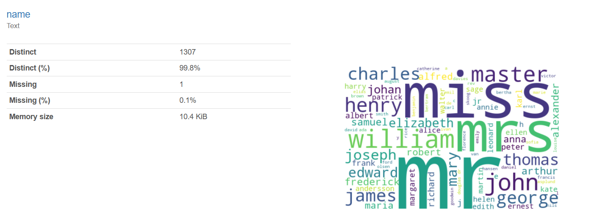

    
# Data Profiling Sn 

## Tells you **EVERYTHING** about your data.

    

    
## Table of Contents

- [Solution Overview](#solution-overview)
- [Who will use this ?](#who-can-use)
- [Advantages of Using](#advantages-of-using)
- [Return on Investment (ROI)](#return-on-investment-roi)
- [How it Works](#how-it-works)
- [Conclusion](#conclusion)
- [Getting Started](#getting-started)
- [Solution Features](#solution-features)
- [Code Features](#code-features)
- [Deliverables or Figures](#deliverables-or-figures)
- [Contact Information](#contact-information)

**Data profiling** is crucial for comprehending the structure and quality of a dataset, helping analysts identify anomalies and inconsistencies that may affect analysis outcomes. By systematically examining variables, data types, and distributions, data profiling lays the groundwork for effective data cleaning, preprocessing, and modeling, ensuring accurate and reliable insights are derived. 

**Descriptive statistics** serve as a fundamental tool for data scientists to comprehend the characteristics of their datasets, enabling them to uncover patterns and trends. By summarizing key features such as central tendency and variability, descriptive statistics offer concise insights into the distribution of data, facilitating informed decision-making and hypothesis testing. Ultimately, their utilization empowers data scientists to extract meaningful interpretations and communicate findings effectively to stakeholders, driving informed actions and solutions.

**Descriptive statistics** involve methods for summarizing and describing the features of the entire dataset. 

Statistics includes measures such as **mean, median, and mode** for **central tendency**, as well as measures like **standard deviation** and range for dispersion or spread. 

These statistics offer insights into the **distribution, variability, and characteristics** of the data, aiding in understanding and interpreting its underlying patterns and trends.

## Here is an enumerated list of the statistics provided per variable in data analysis

### **Quantile Statistics**:
1. **Minimum (0th percentile)**: The smallest value in the data set.
2. **5th Percentile**: The value below which 5% of the data falls.
3. **Q1 (First Quartile)**: The value below which 25% of the data falls, representing the lower quartile.
4. **Median (50th Percentile)**: The middle value of the data set when arranged in order.
5. **Q3 (Third Quartile)**: The value below which 75% of the data falls, representing the upper quartile.
6. **95th Percentile**: The value below which 95% of the data falls.
7. **Maximum (100th Percentile)**: The largest value in the data set.
8. **Range**: The difference between the maximum and minimum values, indicating the spread of the data.
9. **Interquartile Range (IQR)**: The difference between the third quartile (Q3) and the first quartile (Q1), measuring the spread of the middle 50% of the data.

### **Descriptive Statistics**:
10. **Standard Deviation**: A measure of the average deviation of each data point from the mean, indicating the spread of the data.
11. **Coefficient of Variation (CV)**: The ratio of the standard deviation to the mean, showing the relative variability of the data.
12. **Kurtosis**: A measure of the "tailedness" or the sharpness of the peak of the data distribution compared to a normal distribution.
13. **Mean**: The average value of all the data points.
14. **Median Absolute Deviation (MAD)**: The median of the absolute deviations from the median, used as a robust measure of variability.
15. **Skewness**: A measure of the asymmetry of the data distribution, indicating whether it is skewed to the left or right.
16. **Sum**: The total of all data values added together.
17. **Variance**: The average squared deviation of each data point from the mean, representing the spread of the data.
18. **Monotonicity**: Describes whether the data consistently increases or decreases, with "Not monotonic" indicating no consistent trend.

This list covers the essential statistics used for analyzing the distribution and spread of variables in a dataset.

    

    
## Getting Started

The goal of this solution is to **Jump Start** your development and have you up and running in 30 minutes. 

To get started with the **Data Profiling Sn** solution repository, follow these steps:
1. Clone the repository to your local machine.
2. Install the required dependencies listed at the top of the notebook.
3. Explore the example code provided in the repository and experiment.
4. Run the notebook and make it your own - **EASY !**
    
## Solution Features

- Easy to understand and use  
- Easily Configurable 
- Quickly start your project with pre-built templates
- Its Fast and Automated
- Saves You Time 

## Code Features

These features are designed to provide everything you need for **Data Profiling Sn** 

- **Self Documenting** - Automatically identifes major steps in notebook 
- **Self Testing** - Unit Testing for each function
- **Easily Configurable** - Easily modify with **config.INI** - keyname value pairs
- **Includes Talking Code** - The code explains itself 
- **Self Logging** - Enhanced python standard logging   
- **Self Debugging** - Enhanced python standard debugging
- **Low Code** - or - No Code  - Most solutions are under 50 lines of code
- **Educational** - Includes educational dialogue and background material

    
## List of Figures
                      
    

## Github https://github.com/SynNAC01/ - Email  michael.mcnees@syndicusinc.com 
    

    
